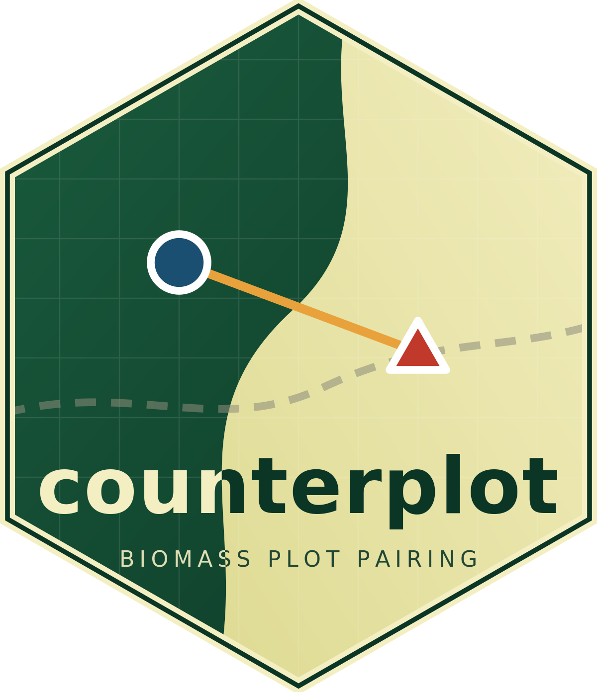

# CounterPlot | Kuamut Rainforest Conservation Project


Site selection for a second wave of forest biomass plots in the Kuamut Rainforest Conservation project | IFM (Sabah, Malaysia, ~84,000 ha). For every existing plot the code places a
new 30 m-radius plot 100–300 m away in a **contrasting** biomass condition, so
that each pair samples two ends of the local aboveground carbon density (ACD)
range under near-identical conditions of access, terrain and acquisition date.

The pairs are intended to strengthen the plot-to-remote-sensing calibration: the
original 46 plots were placed for accessibility and to span the biomass range,
which leaves the model weakly constrained where ACD changes sharply over short
distances. A paired design puts two measurements either side of that gradient.

Everything runs offline in R from four local layers. No account, API key or
cloud service is needed.

---

## Contents
 
- [How it works](#how-it-works)
- [Repository layout](#repository-layout)
- [Requirements](#requirements)
- [Input data](#input-data)
- [Quick start](#quick-start)
- [Selection criteria](#selection-criteria)
- [Scoring and assignment](#scoring-and-assignment)
- [Parameters](#parameters)
- [Outputs](#outputs)
- [Results of the delivered run](#results-of-the-delivered-run)
- [Known issues and limitations](#known-issues-and-limitations)
---
 
## How it works
 
1. **Direction.** Each existing plot is compared with the project-wide ACD
   median. Above it, the code looks for low biomass nearby; below it, high.
   Plot ACD is the mean over the 60 m footprint — what a crew actually records —
   not the value of the single 30 m pixel under the plot centre.
2. **Candidates.** A 10 m grid is laid over the 100–300 m annulus around the
   plot, giving roughly 1,000–2,200 admissible points per plot after the hard
   filters (project area, road distance, ACD floor, local homogeneity,
   separation, nearest-neighbour rule).
3. **Score.** Every candidate is scored on contrast, accessibility, local
   homogeneity and walking distance.
4. **Assignment.** Greedy, most-constrained plot first, then a refinement loop
   that re-picks each plot against all the others until nothing improves.
5. **Verification.** The script re-checks the finished design: pair distances,
   minimum separation, and that every new plot's nearest neighbour really is its
   own reference plot.
6. **Reporting.** An overview map, an eight-panel diagnostics figure, per-pair
   zoom panels and a summary table are written alongside the spatial outputs.
---
 
## Repository layout
 
```
.
├── README.md
├── LICENSE
├── .gitignore
├── scripts/
│   └── 02_kuamut_paired_plots_v9.R   the whole pipeline: selection + graphics
├── data/                             inputs — NOT tracked
└── outputs/                          results — NOT tracked
```
 
Project data (the ACD map, plot coordinates, road network, project boundary) is
not in this repository and should not be committed. Suggested `.gitignore`:
 
```gitignore
data/
outputs/
*.tif
*.shp
*.shx
*.dbf
*.prj
*.cpg
*.gpkg
.Rhistory
.RData
.Rproj.user/
```
 
---
 
## Requirements
 
R ≥ 4.1 (the script uses the native `|>` pipe) with:
 
```r
install.packages(c("terra", "sf", "dplyr"))
```
 
`terra` and `sf` need GDAL, PROJ and GEOS. On Windows the CRAN binaries bundle
them; on Linux install `gdal-bin libgdal-dev libproj-dev libgeos-dev` first.
The figures use base graphics only — no extra plotting packages.
 
---
 
## Input data
 
All layers are handled in **EPSG:32650 (WGS 84 / UTM zone 50N)**; the script
reprojects vectors on read, so the raster must already be in that CRS.
 
| File | Type | Notes |
|---|---|---|
| `acd_2021_30.tif` … `acd_2025_30m.tif` | five rasters, 30 m, same grid | Band 1 = ACD in Mg C ha⁻¹. Paths are listed in `F_ACD_YEARS`. Bands 2–3 (`ci_low`, `ci_upper`) are the maps' own confidence intervals and are not used in the selection. |
| `KuamutLocations.shp` | points | Existing plot centres. Needs the plot-number field named in `PLOT_ID_FIELD` (default `Pl`). |
| `Kuamut_ProjectArea.shp` | polygon | Project boundary; candidates must fall inside it. |
| `Permian Roads- all.shp` | lines | Road and skid-trail network used for the accessibility term. |
| `Kuamut_Elevation.tif` | raster, any CRS | Elevation (SRTM-derived); warped onto the ACD grid and used for slope, height above the road and the approach check. |
| `kuamutnorthroad.shp` | lines | The accessible north road. Ships without a `.prj`, so the script assigns `NROAD_EPSG`. |
 
**No river layer was available** when this was built. If you have one, add a
minimum distance-to-river filter to the candidate mask — see
[Known issues](#known-issues-and-limitations).
 
---
 
## Quick start
 
Set the two folders at the top of the script and source it:
 
```r
DIR_IN  <- "data"        # folder holding the inputs
DIR_OUT <- "outputs"
```
 
Everything else runs unattended; expect a few minutes, most of it in
`terra::distance()` on the road raster.
 
> **Before committing:** `DIR_IN` and `DIR_OUT` are absolute Windows paths in the
> working copy. Replace them with relative paths or with `here::here()` before
> pushing — absolute paths break the script for everyone else and leak local
> directory structure.
 
Console output ends with the verification block:
 
```
plots total: 92 | closest pair overall: 98.6 m
pair distances: 100-298 m (target 100-300)
road distance of new plots: median 90 m, max 376 m
nearest-neighbour rule: 0 violations out of 46 new plots
```
 
---
 
## Selection criteria
 
| Criterion | Rule | Why |
|---|---|---|
| Pair distance | 100–300 m from the reference plot | Design requirement: same forest type, same access, different condition. |
| Contrast direction | **Free**: the new plot must differ by ≥ 40 Mg C ha⁻¹ in *either* direction; the spread objective picks the side | Forcing every above-median plot to look low piled the new sample into the bottom deciles. ACD is the footprint mean over a circle of radius `PLOT_RADIUS`, renormalised for missing cells. |
| Open water | ≥ `NODATA_BUFFER` from any cell that is nodata in any annual map | The ACD maps are nodata over water, so this is the river mask; the buffer also removes the bank cells where the maps return 275+ Mg C ha⁻¹. |
| Terrain of the brothers and their pairs | footprint-mean slope ≤ `SLOPE_LEVELS`, \|height above the nearest road point\| ≤ `CLIMB_ROAD_MAX`, approach slope ≤ `APPROACH_SLOPE_MAX`, brother-to-pair height difference ≤ `CLIMB_PAIR_MAX` | Walking effort, not map distance, is what costs the field team. |
| Spread along the road | the road's northing range is cut into `N_BANDS`; unused bands and northern positions score higher | Car access is faster at the northern end. |
| North-road brothers | ACD within `MATCH_LEVELS` of the hard plot on the multi-year median **and** within `MATCH_YEAR_TOL` in every year; within `NROAD_MAX` of the north road, preferring `NROAD_PREF`; must admit a valid pair | Same biomass condition, far less walking. |
| Footprint evaluation | **Exact**: the area-weighted mean of each annual map over the true 30 m-radius circle centred on the plot point | v4 read a focal raster, which centred the circle on the containing 30 m cell — up to 20 m away — and approximated it with a 5-cell plus shape covering 4,500 m² instead of 2,827 m² |
| Reproducibility | `SEED = 123` is set and every ordering has an explicit tie-break | the algorithm draws no random numbers, but ties in the greedy order could otherwise resolve differently between runs; two consecutive runs now produce byte-identical output |
| Temporal stability of the ground | relative spread (1.4826·MAD/median across the five maps) ≤ `RS_MAX` **and** \|trend\| ≤ `SLOPE_MAX` | Ground that was logged or is regrowing cannot anchor a stable plot. 74% of the project area passes. |
| Temporal stability of the contrast | same sign **and** ≥ `DELTA_YEAR_MIN` in **every** annual map | A contrast visible in only one year's map is probably map error. |
| Spread of the whole sample | Prefer candidates that fill an under-occupied ACD decile; extreme deciles weighted 3× the central ones | The biomass-to-remote-sensing relationship is least constrained in the tails. |
| Contrast magnitude | \|ΔACD\| ≥ 40 Mg C ha⁻¹, relaxed through 30 → 20 → 10 → 0 only if infeasible | Below ~40 the difference is not separable from map error. The fallback level reached is recorded per plot. |
| Separation | ≥ 100 m from every other plot centre, existing and new | Avoids overlapping 15 m footprints and heavy spatial autocorrelation. |
| Nearest-neighbour rule | The new plot must be ≥ 25 m closer to its own reference plot than to any other plot | A pair is only a pair if its members are each other's local context. Without this, a new plot can end up beside a different pair and confound the comparison. |
| Road distance | ≥ `PLOT_RADIUS` + 10 m (40 m), and ≤ max(200 m, the reference plot's own road distance) | The 60 m footprint must not include the road; access is never worse than its pair's. Re-measured exactly on the chosen points, with a warning for any that slip through. |
| ACD floor | ≥ 10 Mg C ha⁻¹ | Rules out water, bare rock and road platform masquerading as "low biomass". |
| Local homogeneity | sd(ACD) in the 90 × 90 m window ≤ 35 Mg C ha⁻¹ | 90 m covers the 60 m footprint plus a 15 m margin, so this tests whether the plot itself straddles an edge. |
| Project area | Inside the boundary | — |
 
---
 
## Scoring and assignment
 
```
score = 0.30 · min(ΔACD / 100, 1)               contrast, saturating
      + 0.30 · stratum_deficit                  spread, tail-weighted
      + 0.15 · (1 − road_distance / 400)        accessibility
      + 0.10 · (1 − local_sd / 30)              homogeneity
      + 0.15 · (1 − (pair_distance − 100)/200)  walking effort
```
 
**Contrast saturates at 100 Mg C ha⁻¹ deliberately.** Once a large difference is
achieved, the remaining terms decide. Without saturation the optimiser chases the
single most extreme pixel in the annulus, which is almost always on an edge or at
the least convenient spot on the ground.
 
`stratum_deficit` is dynamic. The project ACD range is cut into deciles, each
holding 10% of the area; a tail-weighted target is set for the 92-plot sample
(13 plots in decile 1, 5 in decile 5, 13 in decile 10); each candidate is
rewarded in proportion to how far its own decile still falls short, counting the
46 existing plots and everything already assigned.
 
**Assignment** (`greedy_assign()`) runs in two stages:
 
1. *Greedy*, taking the reference plot with the fewest admissible candidates
   first, so the most constrained plots are not squeezed out by later ones.
2. *Refinement*, up to `ROUNDS` passes: each plot, worst contrast first, is
   re-picked against the current choices of all the others and moved only if its
   score improves. This removes the dependence on the arbitrary greedy order.
The nearest-neighbour rule is enforced in both places: against the existing plots
when candidates are generated, and mutually between new plots during assignment —
a candidate is rejected if it would end up closer to an already-placed new plot
than either of them is to its own reference plot.
 
---
 
## Parameters
 
All at the top of `02_kuamut_paired_plots_v9.R`.
 
| Parameter | Default | Meaning |
|---|---|---|
| `PAIR_MIN`, `PAIR_MAX` | 100, 300 | m, admissible distance to the reference plot |
| `RS_MAX`, `SLOPE_MAX`, `RS_FLOOR` | 0.20, 6, 20 | temporal stability of the ground: relative spread, Mg C ha⁻¹ yr⁻¹ trend, and the floor that stops low-biomass ground being penalised |
| `DELTA_YEAR_MIN` | 20 | Mg C ha⁻¹ the contrast must reach in every annual map |
| `HARD_PLOTS` | 23, 24, 32, 33, 37, 38, 41, 42, 45, 46 | reference plots that get a north-road brother |
| `NROAD_MAX`, `NROAD_PREF`, `NROAD_PREF_SD` | 1500, 500, 400 | m, corridor width and the preferred stand-off from the road |
| `SLOPE_LEVELS` | 15, 20, 25 | deg, footprint-mean slope ladder for brothers and their pairs |
| `CLIMB_ROAD_MAX`, `APPROACH_SLOPE_MAX`, `CLIMB_PAIR_MAX` | 60, 25, 40 | m / deg / m, height above the road, steepest approach, brother-to-pair height difference |
| `NODATA_BUFFER` | 90 | m, exclusion buffer around water (nodata in any annual map) |
| `N_BANDS` | 10 | road northing bands, one brother per band as the target |
| `MATCH_LEVELS`, `MATCH_YEAR_TOL` | 5/10/15/20/30, 30 | Mg C ha⁻¹, ACD match ladder and the per-year tolerance |
| `SEED` | 123 | set for reproducibility; the algorithm itself is deterministic |
| `PLOT_RADIUS` | 30 | m, plot radius (60 m diameter). Footprint size, road clearance and the ACD averaging kernel all derive from it |
| `MIN_SEP` | 100 | m, minimum distance to any other plot centre |
| `NN_MARGIN` | 25 | m, how much closer a new plot must be to its own pair than to anything else |
| `ROAD_MIN` | `PLOT_RADIUS + 10` = 40 | m, minimum distance to a road |
| `ROAD_CAP_FLOOR` | 200 | m, road-distance allowance for plots that sit on a road |
| `SD_HARD` | 35 | Mg C ha⁻¹, maximum ACD sd in the 90 m window |
| `SD_SCALE` | 30 | Mg C ha⁻¹, scaling of the homogeneity score term |
| `MIN_ACD` | 10 | Mg C ha⁻¹, candidate ACD floor |
| `CONTRAST_SAT` | 100 | Mg C ha⁻¹, contrast saturation point |
| `DELTA_LEVELS` | 40, 30, 20, 10, 0 | contrast ladder, tried in order |
| `GRID` | 10 | m, candidate search grid |
| `ROUNDS` | 8 | maximum refinement passes |
| `PLOT_ID_FIELD` | `"Pl"` | plot-number field in the plot shapefile |
| `EPSG` | 32650 | working CRS |
| `DIRECTION` | `"free"` | `"free"` = contrast either way; `"median"` = the older rule where above-median plots always look low |
| `N_BINS`, `TAIL_BOOST` | 10, 2 | ACD strata and how much extra weight the extreme strata carry |
| `TOL` | 0.01 | minimum score gain to accept a move in refinement; stops the coordinate descent oscillating |
| `W_CONTRAST`, `W_COVER`, `W_ACCESS`, `W_HOMOG`, `W_PROX` | 0.30, 0.30, 0.15, 0.10, 0.15 | score weights, must sum to 1 |
 
Sensitivity worth knowing: `NN_MARGIN` at 0, 10, 25 and 50 m gives an **identical
design**. The nearest-neighbour rule itself is binding, its tolerance is not, so
25 m is free insurance against GPS error.
 
---
 
## Outputs
 
Written to `DIR_OUT`, all stemmed `Kuamut_paired_plots_v9`:
 
**Spatial**
 
| File | Contents |
|---|---|
| `*.gpkg` | layers `paired_plots`, `existing_plots`, `pair_links`, `new_plot_footprints_30m` (UTM 50N) |
| `*.kml` | WGS84 points for Google Earth / Avenza / field navigation |
| `*.csv` | full attribute table with UTM and lon/lat |
 
Attribute columns: `Pl_new`, `Pl_ref`, `target`, `cls_ref`/`cls_new` (ACD
tercile class), `ACD_ref`, `ACD_new`, `dACD`, `d_pair`, `d_other` (distance to
the nearest other plot), `road_ref`, `road_new`, `road_exact`, `acd_sd`, `score`, `x`/`y`,
`lon`/`lat`. Naming convention: the pair of plot `20` is `20B`.
 
**Figures and report**
 
| File | Contents |
|---|---|
| `*_map.png` | Overview: ACD raster, project boundary, roads, both plot sets, pair links, labels, scale bar and north arrow |
| `*_diagnostics.png` | Eight panels: (a) where plots sit in the project ACD distribution, (b) per-pair reference → paired shift, (c) tercile shares of area vs plots, (d) plots per ACD decile, (e) contrast achieved per pair, (f) plot-level ACD boxplots, (g) distance-to-road ECDF old vs new, (h) pair distance histogram with local ACD sd overlaid |
| `*_pairs_01.png`, `_02.png`, … | Per-pair zoom panels, 12 per page, each a 500 m window on the ACD map |
| `*_summary.csv` | The numbers behind the figures: tercile shares, decile occupancy, ACD-space coverage, contrast and access statistics |
 
Two coverage metrics in the summary are worth reading together. **Deciles
occupied** counts how many of the ten equal-area ACD deciles contain at least one
plot. **ACD space covered** is the share of the project area whose ACD sits within
one 5 Mg C ha⁻¹ bin of at least one plot value — a stricter measure of how much of
the biomass range the calibration data actually constrains.
 
---
 
## Results of the delivered run
 
46 existing plots (the source shapefile holds 46, not 49 — `Pl` = 1…46, no
duplicates or nulls), 46 pairs, 92 plots total.
 
| Metric | Value |
|---|---|
| Pairs placed | 46 / 46 |
| Temporally stable project area | 74% |
| Existing plots that are NOT stable | 7 of 46 |
| Meeting ΔACD ≥ 40 | 44; one at 30–40, one at 20–30 |
| \|ΔACD\| (multi-year median) | median 52, mean 57, min 23, max 99 Mg C ha⁻¹ |
| \|ΔACD\| in the worst single year | median 39, min 21 Mg C ha⁻¹ |
| Pair distance | 100–291 m, median 170 m |
| Nearest-neighbour rule | 0 violations; margin 58 m at the tightest, 707 m median |
| Road distance, new plots | median 110 m, max 355 m (existing plots: median 173 m, max 498 m) |
| Local ACD sd at new plots | median 16, max 34 Mg C ha⁻¹ |
| Mean plot ACD | 101 existing → 88 new Mg C ha⁻¹ |
| New-plot ACD range | 12–205 Mg C ha⁻¹ |
 
**Spread of the 92-plot sample across the project ACD deciles**
 
| decile | 1 | 2 | 3 | 4 | 5 | 6 | 7 | 8 | 9 | 10 |
|---|---|---|---|---|---|---|---|---|---|---|
| existing 46 | 5 | 3 | 6 | 3 | 3 | 4 | 1 | 4 | 7 | 10 |
| new 46 | 9 | 5 | 5 | 5 | 2 | 1 | 6 | 5 | 5 | 3 |
| **combined** | **13** | **11** | **10** | **7** | **5** | **5** | **7** | **9** | **11** | **14** |
| target | 13 | 11 | 9 | 7 | 5 | 5 | 7 | 9 | 11 | 13 |
 
Total absolute deviation from target: 2 plots. Lower half 46, upper half 46.
 
**Plot size drives the achievable contrast.** These figures are for
`PLOT_RADIUS = 30`. At 15 m the same code returned a median \|ΔACD\| near 87.
The difference is not a change in method but in what the plot measures:
averaging ACD over 2,800 m² instead of 700 m² smooths away the local extremes,
so two plots 100–300 m apart genuinely cannot differ as much.
 
**The spread objective trades a little contrast for a lot of coverage.** Median
\|ΔACD\| is 55 against 60 for the pure-contrast version, because the best-contrast
candidate is not always the one that fills an empty stratum. In exchange the weak
tail disappears — minimum contrast rises from 7.5 to 30.7, pairs above 40 go from
37 to 42 — and the sample stops leaning low: 46 plots in the bottom five deciles
against 46 in the top five, where the pure-contrast version gave 51 and 41.
 
---
 
## Known issues and limitations
 
1. **Road distance is filtered on a 30 m raster.** `terra::distance()` runs on
   the ACD grid, so the `ROAD_MIN` filter is only accurate to about half a pixel.
   The script now re-measures the chosen points with exact geometry
   (`road_exact`) and warns about any that fall short, but it does not move them
   automatically. In the delivered run **four plots sit between 29 and 38 m from
   a road** against a 40 m threshold — the road stays outside the 30 m footprint
   in all four, but the margin is thin. Either nudge them by hand or rebuild the
   distance raster at 10 m and re-run.
2. **No river layer.** A low-ACD candidate could be a river bar or an eroding
   bank. Add `river_dist >= 30` to the candidate mask when the layer is available
   — one line alongside the existing road filter.
3. **No terrain screening.** The pipeline takes no DEM, so nothing stops a plot
   landing on a cliff or well above its reference plot. To add it, read a clipped
   DEM with `terra::rast()`, derive slope with `terra::terrain()`, and add
   `elev <= cap`, `slope <= 30` and `abs(elev - elev_ref) <= 80` to the candidate
   mask. A bare-earth DEM is worth the trouble here: surface models still carry
   the canopy over closed forest, so their slope partly describes the treetops
   rather than the ground the crews walk on.
4. **The ACD map is modelled.** `ci_low` / `ci_upper` give the map's own interval
   at each point and are wide in several cases. Check a handful of picks against
   high-resolution imagery before committing a field campaign.
5. **Design objective.** The score maximises local contrast. If the real goal is
   to reduce calibration error over a specific range — say ACD > 150, where plots
   are scarce — replace the contrast term with a weight on under-represented ACD
   bins. That is two lines in the score, and it is worth deciding before fieldwork
   rather than after.
---
 
## Licence
 
Add a `LICENSE` file for the code before publishing; the repository has none at
the time of writing. Project data is not distributed here.
 
